# 电影数据可视化系统
### 项目定位

本项目为哈尔滨工业大学（深圳）2018年秋季软件工程课程实践项目。

目标为实现一个电影数据可视化系统。

### 仓库结构

	.
	├── README.md
	├── Source
	├── ebotdb.sql
	├── project
	└── requirements.txt

Source文件夹下为README所需图片以及文档、答辩ppt；ebot.sql为MySql数据库文件，需要手动添加；project文件夹内为代码部分；requirements.txt中包含本项目所需Python包依赖。
### 项目架构
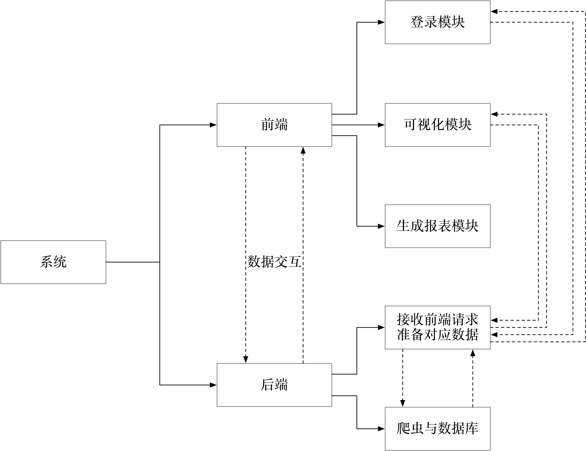
对应各部分框架

* 后端：[django](https://www.djangoproject.com/)
* 前端：[Vue.js](https://vuejs.org/)
* 数据库：[MySql](https://www.mysql.com/)

### 人员分工

|学号|id|分工|
|:----:|:-----:|:------:|
|SZ160110227|[MVzf3YGZ](https://github.com/MVzf3YGZ)|管理数据库、爬虫功能|
|SZ160110232|[xiehuapeng](https://github.com/xiehuapeng)|前端架构、前后端整合|
|SZ160110217|[wangguanxiong1](https://github.com/wangguanxiong1)|后端功能实现、前后端整合|
|SZ160110128|[cs-zyf](https://github.com/cs-zyf)|后端功能实现、前后端整合|

### 在本机启动项目

Python版本为3.6。

启动项目前，请导入数据库文件，新建一个数据库命名为ebotdb，密码设置为qwerty1601

npm安装的库如下

	├── echarts
	├── ij-rpc-client
	├── jspdf
	├── npm
	├── vue-cli
	├── vue-resource
	├── vuex
	└── webpack

启动步骤

```
$ git clone https://github.com/MVzf3YGZ/4_SE2018.git
$ cd project
$ pip install requirements.txt
$ cd project
$ cd vue2_frontend
$ npm install
$ npm run build
$ cd ..
$ python manage.py runserver
```

在Chrome/Firefox/Safari等浏览器中输入地址 [http://127.0.0.1:8000/](http://127.0.0.1:8000/) 查看效果
### 功能展示

这部分展示已经完成的四个功能

- [x] 用户登录
- [x] 爬虫与数据库
- [x] 可视化
- [x] 生成报表

demo地址：[百度网盘](https://pan.baidu.com/s/1WUqnxQXJ7ibuOqLmEuSaTQ ) 提取码: qupv

#### 用户登录


`新加入了游客登录功能，游客只能查看默认的票房份额，不能进行其他操作`

<div align=center>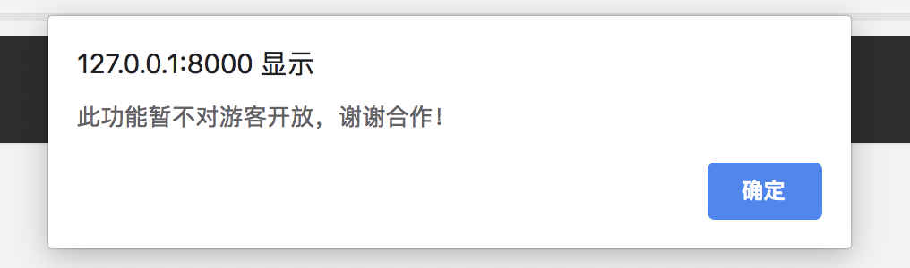</div>


#### 爬虫与数据库

<div align=center>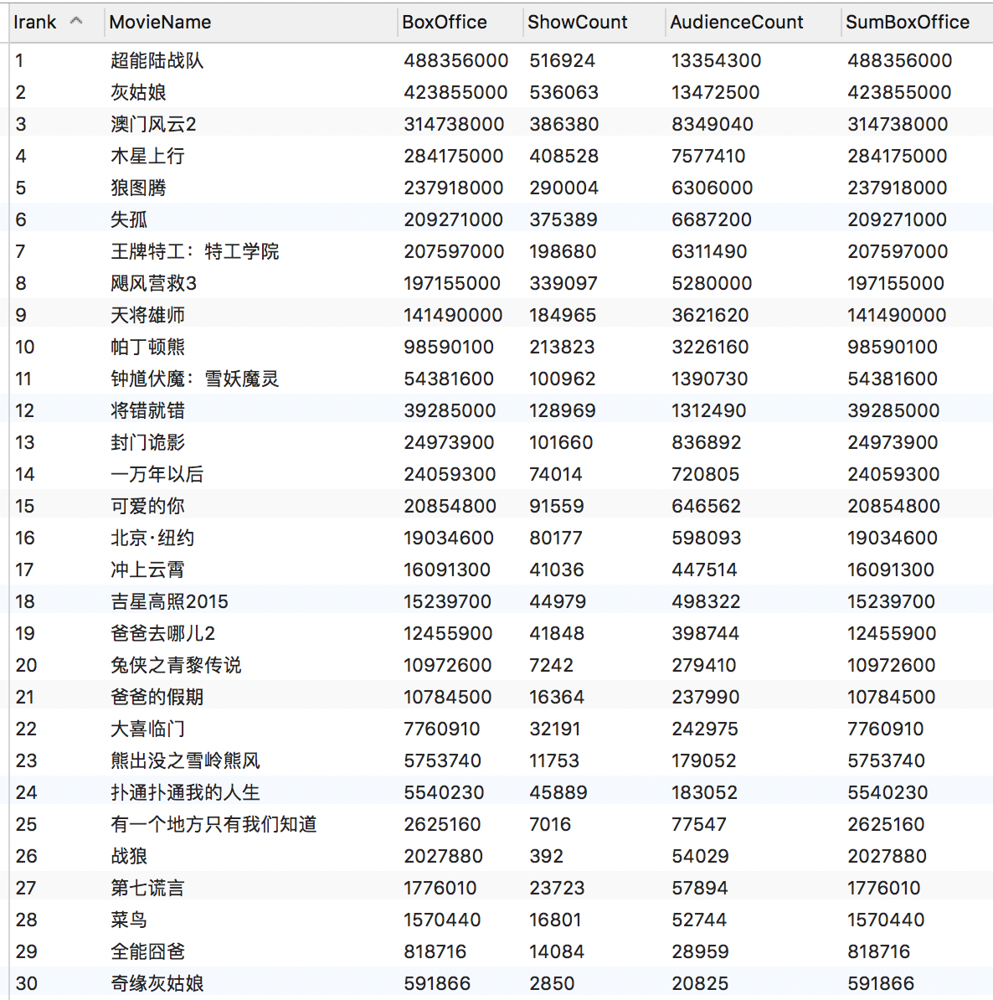</div>

#### 可视化

##### 功能选择

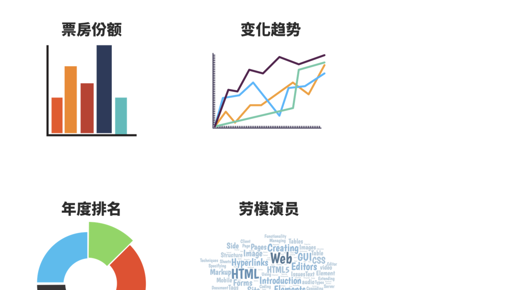

##### 票房份额

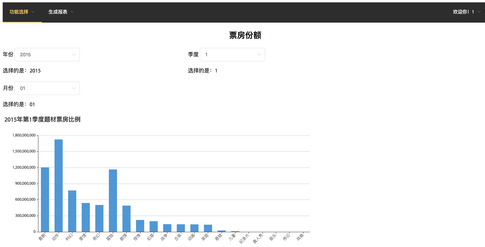

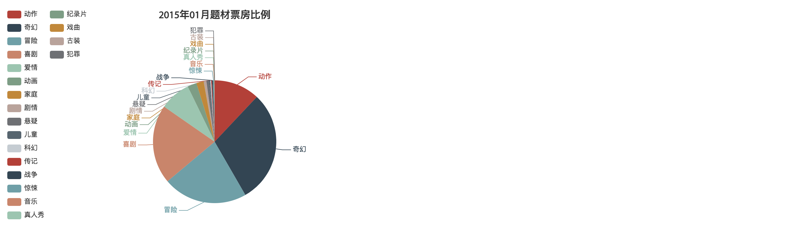

##### 变化趋势

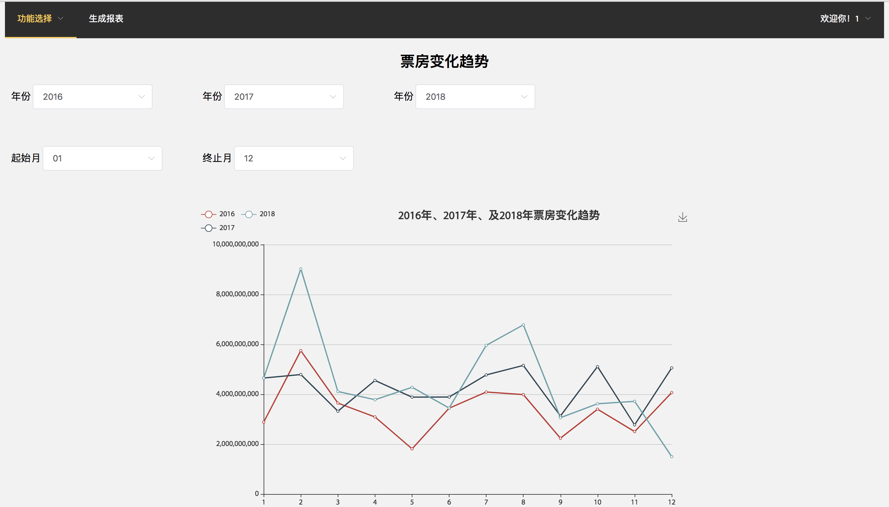

##### 年度排名

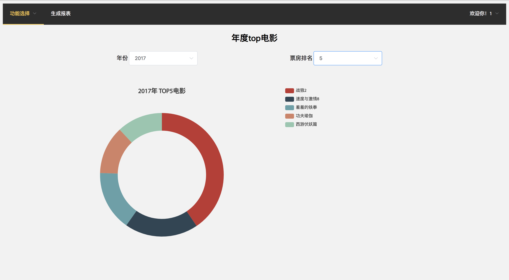

**已经对溢出数据进行了修正，现在的票房数据是正确的**

**原因是设计数据库时未考虑到32位整数不够存的问题**

##### 劳模演员
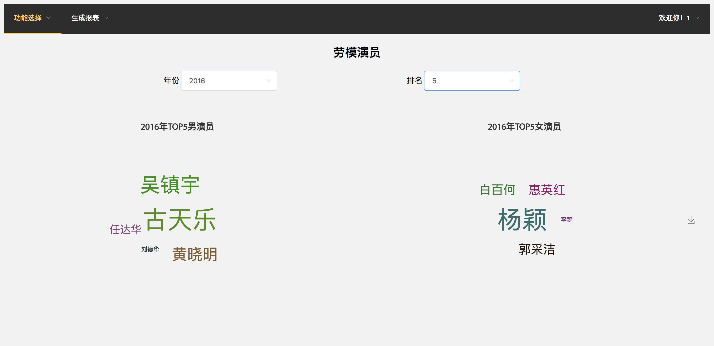

#### 生成报表

`在本次的版本中，用户可以选择将当前页面的内容加入报表，最终在前端生成并下载报表`

<div align=left>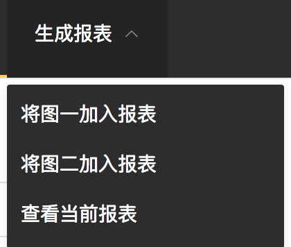</div>

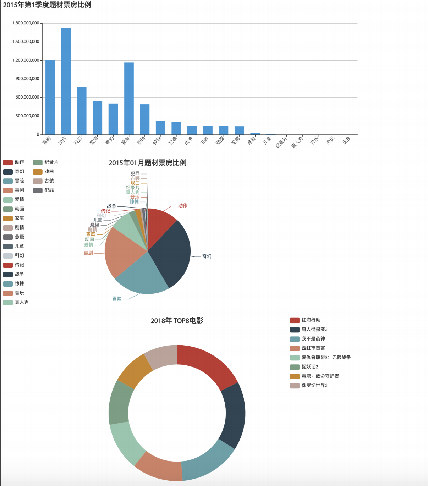

### 可能的问题

1. 生成报表故障：生成pdf使用的jsPDF库兼容性不够好，如果无法生成报表可以通过尝试重新安装jsPDF或删除 `/project/vue2_frontend/node_modules/jsPDF`文件夹；
2. 爬虫功能失效：在开发时，为了避免ip封禁，采用购买代理ip池的方式，来自[蘑菇代理](http://www.moguproxy.com/)，一定时间后，代理会失效，只要替换`/project/spider_app`内Python代码的headers部分即可。

